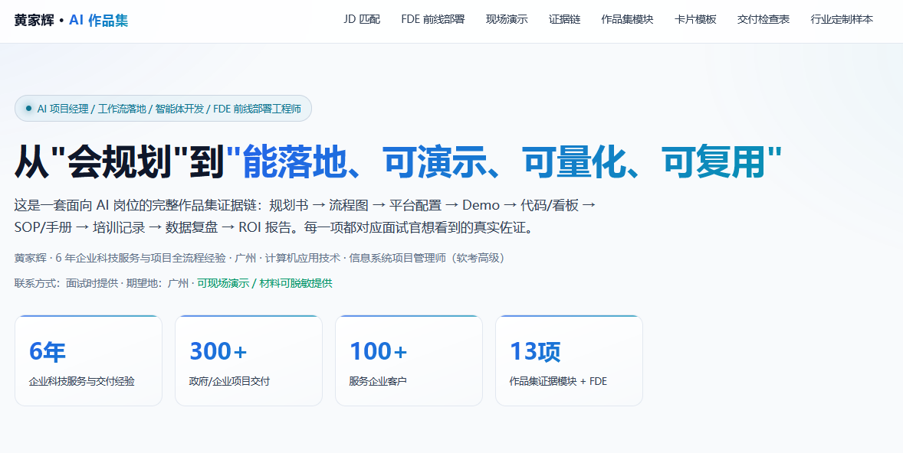

# 黄家辉 · AI 数字化落地作品集



> 从「会规划」到「能落地、可演示、可量化、可复用」

[](https://jav1es.github.io/portfolio/)
[](https://jav1es.github.io/portfolio/)
[](./LICENSE)

[](https://jav1es.github.io/portfolio/#works)
[](https://github.com/Jav1es/enterprise-agents/tree/main/mcp)
[](https://github.com/Jav1es/enterprise-agents/tree/main/mcp)

---

## 📖 目录

- [👋 关于我](#-关于我)
- [🎯 核心亮点](#-核心亮点)
- [📚 作品集模块（14个）](#-作品集模块14-个)
- [🧭 如何使用本作品集](#-如何使用本作品集)
- [🛠 技术栈与实现](#-技术栈与实现)
- [📁 仓库结构](#-仓库结构)
- [📢 诚信说明](#-诚信说明)
- [📬 联系我](#-联系我)

---

## 👋 关于我

**黄家辉** · 5 年+企业科技服务与项目全流程经验 · 广州 · 计算机应用技术 · 软考中级 · 信息系统项目管理师备考中

目标岗位：**AI 项目经理 / AI 工作流落地工程师 / AI 智能体开发工程师 / FDE 前线部署工程师**

我擅长把 AI 从「概念」落到「业务现场」——从需求诊断、方案设计、端到端交付到现场培训，全程打通最后一公里。本作品集是一份完整的**证据链**，每一项都可追溯、可验证、可演示。

---

## 🎯 核心亮点

| 维度 | 内容 |
|---|---|
| **真实项目** | **24 家（含复审）**单年高企通过 · **1 周**最快交付 · **300+** 项目可研 |
| **工程落地** | **6 层**智能体架构 · **83.3%** RAG 检索准确率 · **35 项**测试通过 |
| **开源贡献** | **3 个** MCP Server + **1 个** 跨应用桥接 MCP Server 开源 · CI 全绿 |
| **数据驱动** | 每个项目都有**前后对比量化数据**，全部标注口径 |
| **FDE 能力** | **完整能力映射表** + 2 则实战故事（业务型 + 工程型）|
| **能带队** | **5 年+**客户现场交付 · 从诊断到培训全程主导 |

---

## 📚 作品集模块（14 个）

点击卡片可展开查看完整详情。每个模块包含：业务痛点、我的角色、方案架构、工具栈、实施步骤、关键难点、量化测算、可复用资产、证明链接与复盘。

| # | 模块 | 类型 | 核心亮点 |
|---|---|---|---|
| 01 | AI 工具体系 0-1 搭建规划包 | 📐 方案规划 | 300+ 项目可研/立项经验 · 8 大业务域覆盖 · 6 个月分阶段路线图 |
| 02 | AI 工作流落地标杆 A：企业智能问答与申报文档 AIGC | 🔧 自建 Demo | ≥50% 生成效率提升测算 · ≥85% 审核通过率目标 · AI 先做+人工只审 2 层流 |
| 03 | AI 工作流落地标杆 B：财务 / 行政 / 外贸跟单 | ✅ 已交付 | 24 家单年高企认定通过（含复审） · 70% 人工审核量下降测算 · 92% 准确率目标 |
| 04 | 企业级智能体系统（本地开发工程 enterprise-agent） | ✅ 已交付 | 6 层企业级智能体架构 · 70% HPA 扩缩容 CPU 阈值 · 5 次熔断器连续失败阈值 |
| 05 | 业务数据库与数据监测报告（SQL 报表 + BI/ChatBI） | ✅ 已交付 | 约 40% 减少团队重复工作 · 1 套自建业务数据库 · SQL 报表固化/存储过程 |
| 06 | RAG 知识库 Demo（enterprise-agent 真实带数据演示） | 🔧 自建 Demo | 83.3% 检索准确率@3（真实评测） · 5/6 引用来源准确 · 40 条示例制度文档 |
| 07 | AI 评测与可观测性（评测集纳入 CI 回归 + OTel/Jaeger 全链路追踪） | 🔧 自建 Demo | 8 个单会话 Jaeger trace span · 6 条 CI 每次 push 自动评测 · ≥60% CI 断言阈值 |
| 08 | 办公流程自动化（Open Claw + Python 脚本） | 🔧 自建 Demo | 跨系统重复流程脚本自动化 · 异常告警+人工复核兜底 · SOP 流程沉淀 |
| 09 | Prompt 工程与评测体系 | 🔧 自建 Demo | A/B 对比测试驱动优化 · JSON Schema 输出强校验 · Prompt 结构化模板化 |
| 10 | 培训 / SOP / 推广运营包 | ✅ 已交付 | 70% 自助解决率目标 · 反馈收集→处理→迭代闭环 · 带教培训 SOP 体系 |
| 11 | 技术底座与运维证据 | 🔧 自建 Demo | Docker Compose 一键起服务 · 容错/重试/降级/熔断高可用 · 日志+告警+压测监控 |
| 12 | 项目复盘与量化数据报告 | ✅ 已交付 | 300+ 政府/企业项目交付 · 24 家单年高企通过（含复审） · 95+ 服务企业客户 |
| 13 | 企业级智能体 MCP Server 三件套（开源） | ✅ 已交付 | 3 个 MCP Server 开源 · 35 项 pytest 用例全通过 · 100% 通过率 |
| 14 | dsh-bridge：让 Marvis 调用本机 DeepSeek Harness（开源） | 🔧 开源工具 | 零依赖手写 MCP 协议（3 个工具） · 241 技能 × 77 MCP 工具本地检索 · CI 五步全绿 |

> 模块 13 对应三个独立开源的 MCP Server，仓库地址：[github.com/Jav1es/enterprise-agents/tree/main/mcp](https://github.com/Jav1es/enterprise-agents/tree/main/mcp)
>
> 模块 14 为独立开源项目，仓库地址：[github.com/Jav1es/dsh-bridge](https://github.com/Jav1es/dsh-bridge)（MIT）——把本机 DeepSeek Harness 接进 Marvis：先出派工单，再按建议调技能与 MCP 工具。

---

## 🧭 如何使用本作品集

**3 分钟快速了解我：**

1. 打开 [在线作品集](https://jav1es.github.io/portfolio/)
2. 重点看 3 个模块：**04 enterprise-agent** · **13 MCP Server 三件套** · **FDE 能力映射**
3. 想深入了解，看第 4-8 模块的完整证据链

---

## 🛠 技术栈与实现

- **前端**：纯静态 HTML + CSS + 原生 JavaScript，零框架依赖，加载快
- **Markdown 渲染**：marked.js 实现 .md 文件优雅展示（弹模态框）
- **部署**：GitHub Pages（Deploy from a branch, main / root）
- **数据**：所有作品集内容以 JS 数组形式内嵌于 `index.html`，便于维护
- **附件**：PDF / DOCX / XLSX / PNG / SVG / MD 等原始材料按模块分文件夹归档

---

## 📁 仓库结构

```
portfolio/
├── index.html                 # 作品集主页面（含所有模块数据）
├── 01-ai-toolkit/             # 模块 01 附件
├── 02-ecommerce-ai/           # 模块 02 附件
├── 03-finance-admin-trade-ai/ # 模块 03 附件
├── 04-enterprise-agent/       # 模块 04 附件（含 enterprise-agents 子目录）
├── 05-bi-chatbi/              # 模块 05 附件
├── 06-rpa/                    # 模块 06 附件
├── 07-prompt-engineering/     # 模块 07 附件
├── 08-training-sop/           # 模块 08 附件
├── 09-tech-ops/               # 模块 09 附件
├── 10-retro-reports/          # 模块 10 附件
├── 11-fde-templates/          # 模块 11 附件（FDE 交付物模板）
├── 12-dsh-bridge/             # 模块 14 附件（图标 / 技能定义 / 设计取舍 / MCP 参考 / 排错手册）
└── README.md                  # 本文件
```

---

## 📢 诚信说明

- **真实项**：企业级智能体系统 enterprise-agent、白云科技规划方案、高企认定 / 项目申报交付、自建项目信息数据库与《项目监测报告》均为本人真实经历。
- **口径说明**：凡成效类数字均标注为「测算模型 / 示例口径」，实际以落地数据为准。
- **脱敏处理**：部分客户名称与年度数据已做脱敏，面试时可提供更详细版本。

---

## 📬 联系我

- **在线作品集**：[https://jav1es.github.io/portfolio/](https://jav1es.github.io/portfolio/)
- **GitHub**：[@Jav1es](https://github.com/Jav1es)
- **联系方式**：面试时提供

---

<p align="center">
  <i>本作品集持续更新中，欢迎交流与指正。</i>
</p>
